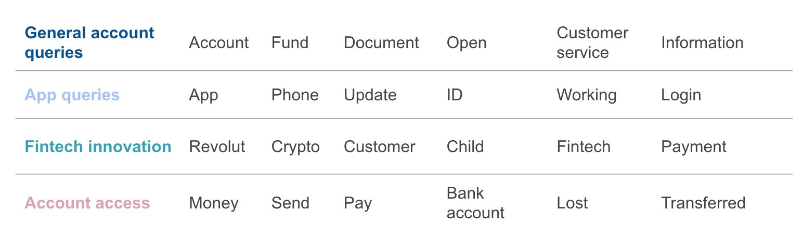

This repo is for Metis project 4 - Fletcher

# Leveraging social media to address customer needs: an investigation into Revolut

## Background

[Revolut](https://www.revolut.com/en-US) is a financial technology (fintech) company that was founded in the United Kingdom in 2015 and has since expanded to Europe, the United States, Canada, Australia, Singapore and Japan.

The company has an active [Twitter account](https://www.revolut.com/en-US), which they use to communicate with followers about exciting news, updates and in-app issues. 

## Objective

Analyze tweets to Revolut to understand opportunities to address customer needs.

## Methods

* **Exploratory data analysis** of customer Tweets
* **Topic modeling and sentiment analysis** 
* **Classification** of tweet intent using XGBoost and Random Forest
* **Desktop review** of the Revolut blog and fintech news

## Findings

Top four topics and the corresponding top 6 words within each topic:

## Insights

The fingings provide helpful insights for Revolut.

**App support**: When there is a new version release, Revolut should expect an increase in tweets and a reduction in sentiment overall due to potential bugs.
* Consider some type of in-app messaging encouraging the use of in-app support. Point being that we want to keep Twitter as a last resort for query requests.
* Increase support staff during these periods in order to timeously address issues that do crop up.
* Investigate the use of in-app support versus twitter support. There appeared to be a large volume of tweets complaining that the in-app support was not working or that they could not locate it within the app. This is something worth looking into to improve in-app support for useability.

**Social media response**: It is important to appropriately prioritize and address the volume of negative tweets the company receives.
* Strongly negative sentiment _and_ classfied as submitting a complaint: These users can be dangerous to the brand online. First assess whether these are bots, if not look to still try to serve and reduce their sentiment so they are not provoked into becoming anti-Revolut.
* Customers submitting queries or requests for support: Prioritize those with a negative or neutral sentiment first to avoid these turning into complaints

## Tools
* Python
* Twint
* Jupyter Notebook
* Pandas
* Numpy
* NLTK
* NMF
* XGBoost
* Random Forest
* Matplotlib
* Seaborn
* Tableau